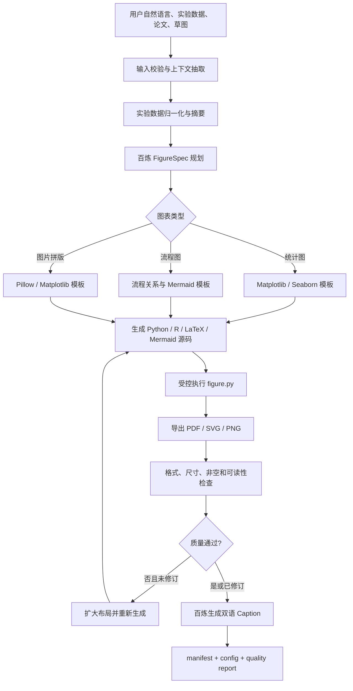

# Academic Figure Agent

基于 LangChain、LangGraph 与阿里云百炼的学术论文绘图创作 Agent。系统接收自然语言、实验数据、论文上下文和已有草图，生成可复现的绘图代码、双语图表、Caption、配置文件和质量检查报告。

## 已实现能力

- 输入：自然语言，CSV/TSV/Excel/JSON/JSONL，PDF/DOCX/TXT/Markdown/LaTeX，上游草图或实验图片。
- 图表：折线图、柱状图、散点图、箱线图、热力图、流程图、定性结果图片拼版。
- 输出：PDF、SVG、PNG，Python、R、LaTeX、Mermaid 源码，中英文 Caption。
- 审计：规范化源数据、SHA-256、FigureSpec、执行日志、质量报告和交付清单。
- 模型：阿里云百炼 OpenAI 兼容接口，默认 `qwen-plus`。
- 安全：百炼只生成结构化 FigureSpec；实际执行的 Python 代码来自受控模板，不执行模型自由生成的任意代码。

## 目录结构

```text
academic-figure-agent/
├── README.md                         # 架构、配置和使用说明
├── pyproject.toml                    # Python 项目元数据
├── requirements.txt                 # pip 兼容依赖
├── .env.example                     # 百炼和运行参数模板
├── .gitignore
├── main.py                           # CLI 入口
├── config/
│   ├── settings.py                   # pydantic-settings 环境配置
│   └── constants.py                  # 格式、配色和全局常量
├── src/academic_figure_agent/
│   ├── agent/
│   │   ├── state.py                  # LangGraph 状态
│   │   ├── nodes.py                  # 工作流节点
│   │   └── graph.py                  # 图定义、路由和调用入口
│   ├── tools/
│   │   ├── data.py                   # 数据读取、校验和归一化
│   │   ├── context.py                # 论文文本和草图元数据提取
│   │   ├── codegen.py                # Python/R/LaTeX/Mermaid 代码生成
│   │   ├── render.py                 # 受控代码执行
│   │   └── quality.py                # PDF/SVG/PNG 质量检查
│   ├── runtime/renderer.py            # Matplotlib/Seaborn 渲染内核
│   ├── llm/bailian.py                 # 阿里百炼模型封装与规划器
│   ├── schemas/figure.py              # 输入、FigureSpec、报告和输出 DTO
│   ├── memory/artifact_store.py       # 历史交付清单读取
│   └── utils/
├── assets/
│   ├── prompts/                       # 规划约束
│   └── examples/                      # 示例请求与实验数据
├── tests/                             # 单元和端到端测试
└── output/                            # 每次任务的交付包
```

## 工作流程



## 环境要求

- Python 3.12
- Windows、Linux 或 macOS
- 阿里云百炼 API Key
- 可选：R + ggplot2，用于执行生成的 `figure.R`
- 可选：TeX Live + PGFPlots，用于编译生成的 `figure.tex`
- 可选：Mermaid CLI，用于独立渲染 `figure.mmd`

## 安装

```powershell
cd academic-figure-agent
python -m venv .venv
.\.venv\Scripts\python.exe -m pip install -e ".[dev]"
Copy-Item .env.example .env
```

在 `.env` 中填写：

```dotenv
DASHSCOPE_API_KEY=你的百炼APIKey
BAILIAN_BASE_URL=https://dashscope.aliyuncs.com/compatible-mode/v1
BAILIAN_MODEL=qwen-plus
```

系统通过 `langchain-openai` 调用百炼 OpenAI 兼容接口。API Key 不应写入源码、示例或 Git。

## CLI 使用

使用百炼规划并生成完整交付包：

```powershell
.\.venv\Scripts\python.exe .\main.py generate `
  "绘制不同模型随扰动强度变化的准确率折线图，显示标准差" `
  --data .\assets\examples\robustness.csv `
  --type line `
  --output .\output\robustness
```

同时传入论文和草图：

```powershell
.\.venv\Scripts\python.exe .\main.py generate `
  "根据论文方法和草图绘制训练流程图" `
  --context .\paper.pdf `
  --sketch .\draft.png `
  --type flowchart
```

从 JSON 请求运行：

```powershell
.\.venv\Scripts\python.exe .\main.py request .\assets\examples\request.json
```

没有百炼 Key 时可使用确定性的离线规划器验证系统：

```powershell
.\.venv\Scripts\python.exe .\main.py generate `
  "比较不同模型在各扰动强度下的准确率" `
  --data .\assets\examples\robustness.csv `
  --type line `
  --offline
```

离线模式用于开发和测试，正式科研图表应使用百炼规划，并由研究者复核标签、统计口径和 Caption。

## Python 接口

```python
from pathlib import Path

from academic_figure_agent import FigureRequest, run_figure_agent

result = run_figure_agent(
    FigureRequest(
        prompt="绘制不同模型在不同 severity 下的 accuracy 折线图",
        data_files=[Path("results.csv")],
        context_files=[Path("experiment.md")],
        output_dir=Path("output/robustness"),
        figure_type="line",
        export_formats=["pdf", "svg", "png"],
        code_formats=["python", "r", "latex", "mermaid"],
        languages=["zh", "en"],
    )
)

print(result.artifacts.manifest_file)
```

## 标准输出

```text
output/<task>/
├── figure_zh.pdf
├── figure_zh.svg
├── figure_zh.png
├── figure_en.pdf
├── figure_en.svg
├── figure_en.png
├── figure.py
├── figure.R
├── figure.tex
├── figure.mmd
├── caption_zh.txt
├── caption_en.txt
├── source_data.csv
├── figure_config.json
├── request.json
├── execution.json
├── quality_report.json
└── manifest.json
```

`source_data.csv` 是统一后的绘图数据。`figure_config.json` 是模型规划出的、与绘图语言无关的 FigureSpec。`execution.json` 保留运行返回码和日志，`quality_report.json` 记录格式解析、像素尺寸、空白图检测、DPI 与源码完整性检查。

## 输入约束

- 数据图必须提供结构化实验数据；Agent 不会从自然语言中捏造数值。
- 多个数据文件按列并集拼接，并增加 `__source_file` 来源列。
- PDF/DOCX 内容仅用于规划图表结构和 Caption，不会覆盖实验数据。
- 草图用于图片拼版和规划参考；当前版本不执行 OCR 或从截图恢复精确数值。
- `figure_type=auto` 时由百炼判断图表类型；显式指定类型优先。

## 质量边界

自动检查能够发现缺失文件、空白图片、无效 SVG、异常 PDF 页数、低 DPI 和代码缺失，但不能替代领域专家判断统计方法是否正确。论文提交前仍应核对误差条含义、显著性检验、坐标截断、单位、颜色和 Caption 结论。

## 测试

```powershell
.\.venv\Scripts\python.exe -m pytest -q
```

测试默认使用离线规划器，不消耗百炼额度；覆盖数据归一化、Schema 约束、统计图全格式导出和无数据流程图生成。

