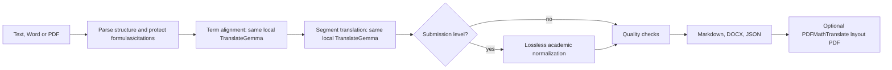

# LangGraph data flow

```mermaid
flowchart LR
  A[Text, Word or PDF] --> B[Parse structure and protect formulas/citations]
  B --> C[Term alignment: same local TranslateGemma]
  C --> D[Segment translation: same local TranslateGemma]
  D --> E{Submission level?}
  E -->|yes| F[Lossless academic normalization]
  E -->|no| G[Quality checks]
  F --> G
  G --> H[Markdown, DOCX, JSON]
  H --> I[Optional PDFMathTranslate layout PDF]
```
